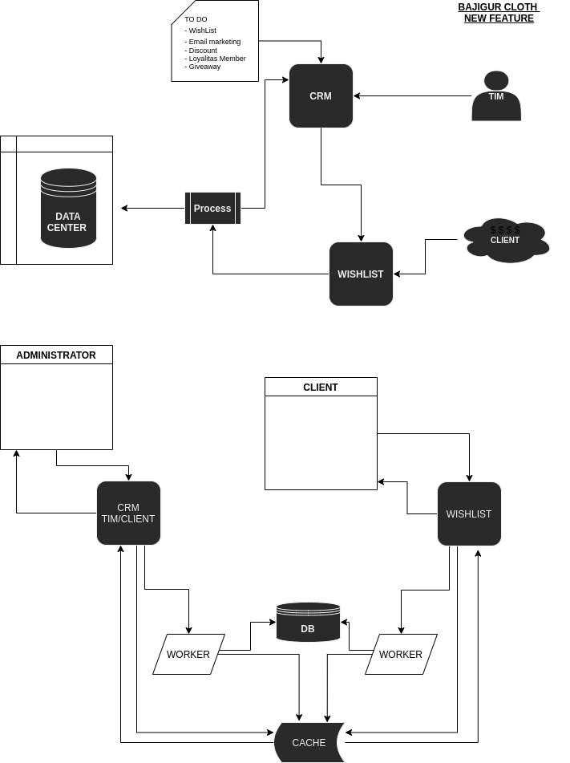

# BAJIGUR CLOTH

## CONCEPTUAL
Melakukan Wishlist oleh Member Setelah di return data WishList menjadi task yang di olah di CRM simple dan statusnya menjadi ON PROGRESS, Setelah itu admin melakukan action untuk di delegasikan ke TIM yang bersangkutan. 

**KEKURANGAN**
1. PERLU DI TAMBAHKAN APIs POST FILTER Delegation SECARA DETAIL. 
2. PERLU FILTER APIs STATUS WISHLIST DI CRM
   
   ***IF YOU WANT MANY FEATURE, LETS HIRE ME!***

## RUN AND SETUP
RUNTIME: Python 3.6.6

Documentasi APIs
- CRM
```http://127.0.0.1:8000/api/v1/crm/docs```
- WISHLIST
  ```http://127.0.0.1:8000/api/v1/wish/docs```


## DRAW PLAN

